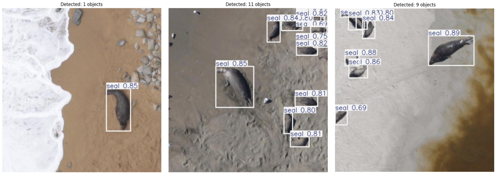
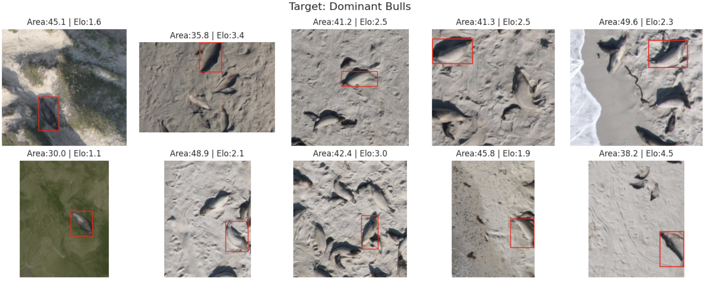

# Automated Seal Detection and Morphological Classification in Aerial Drone Imagery

**A computer vision pipeline for monitoring megafauna using YOLOv8 and CLIP.**

## Overview

Wildlife conservation efforts increasingly rely on Unmanned Aerial Vehicles (UAVs) to monitor megafauna populations in remote environments. While object detection algorithms have proven effective for species identification, extracting demographic information—such as sex ratios and age structures—from aerial imagery remains a significant challenge. This lack of granular data hinders the assessment of reproductive potential and colony stability in polygynous species where dominant males ("bulls") play a critical role.

This project presents an end-to-end computer vision pipeline designed to automate both the census and demographic analysis of seal colonies. Using the **Wildlife Aerial Image Dataset (WAID)**, we employ a fine-tuned **YOLOv8** model to robustly detect and count seals against complex backgrounds containing diverse animal classes. Furthermore, we introduce a novel, unsupervised hybrid clustering approach to estimate colony structure. By integrating geometric morphometrics (normalized area, rotation-invariant elongation), social proximity features, and semantic embeddings from **CLIP**, we successfully isolate dominant male "bull" seals from the general population. This framework offers a scalable, non-invasive tool for monitoring breeding colony dynamics without the need for expensive expert annotation.

## Quick Start

This project is optimized for **Google Colab** to leverage free GPU resources for training and inference. Follow these steps to set up your environment and reproduce the results.

### 1. Prerequisites
* A Google Account (to access Google Drive and Colab).
* The **Wildlife Aerial Image Dataset (WAID)**.

### 2. Data Preparation
The notebook requires the dataset to be hosted on your Google Drive to ensure persistent storage and fast access.

1.  **Download the WAID Dataset** from the [official source](https://github.com/xiaohuicui/WAID).
2.  **Compress the dataset** into a single zip file named **`data.zip`**.
    * *Structure:* Ensure the zip file contains the `WAID` root folder, which holds the `images` and `labels` subdirectories.
3.  **Upload to Google Drive:**
    * Navigate to your Google Drive root.
    * Create a new folder named **`COMP_VISION`**.
    * Upload your `data.zip` file into this folder.
    * *Expected Path:* `My Drive/COMP_VISION/data.zip`

### 3. Running the Analysis
1.  **Open the Notebook:** Upload the `aerial_seal_detection.ipynb` file to [Google Colab](https://colab.research.google.com/).
2.  **Enable GPU Acceleration:**
    * Go to `Runtime` > `Change runtime type`.
    * Select **T4 GPU** (or better) under Hardware accelerator.
    * Click **Save**.
3.  **Execute the Pipeline:**
    * Run the "Global Setup" cell to install dependencies (`ultralytics`, `open_clip_torch`).
    * Run the "Data Restoration" cell. This will automatically mount your Google Drive, locate `data.zip`, and extract it to the local runtime for high-speed training.

> **Note:** If you placed your data in a different folder on Drive, simply update the `DRIVE_ZIP_PATH` variable in the notebook's setup cell to match your location.
